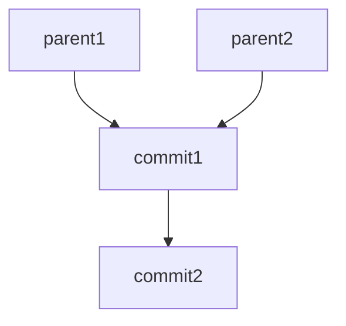
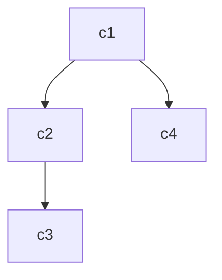

## Commit Dependency Visualizer


Этот инструмент позволяет визуализировать зависимости коммитов для заданного файла в формате **Mermaid**, который можно использовать для построения графов и диаграмм.

### Особенности

- Извлекает данные о зависимостях коммитов (родительские коммиты) для указанного файла в репозитории Git.
- Генерирует текстовый граф в формате Mermaid, готовый для вставки в Markdown или Mermaid Live Editor.
- Позволяет сохранять граф в файл для дальнейшего использования.

---

## Установка и использование

### Требования

- **Python 3.6+**
- Установленный Git (должен быть доступен из командной строки)
- Репозиторий Git с необходимым файлом

### Установка

1. Склонируйте или скопируйте проект в удобное место.
2. Убедитесь, что все зависимости (Git и Python) установлены.

### Запуск

1. Выполните команду в терминале:

```bash
python visualizer.py --repo_path <путь_к_репозиторию> --output_file <путь_к_выходному_файлу> --file_name <имя_файла>
```

2. **Параметры:**
   - `--repo_path`: путь к репозиторию, который необходимо анализировать.
   - `--output_file`: путь, куда сохранить сгенерированный Mermaid-код.
   - `--file_name`: имя файла, для которого строится граф зависимостей.

3. Пример:

```bash
python visualizer.py --repo_path /path/to/repo --output_file dependencies.mmd --file_name main.py
```

---

## Формат выходного файла

Выходной файл будет содержать код Mermaid, например:



Этот код можно вставить в:
- Markdown (внутри блока ` ```mermaid `).
- Mermaid Live Editor: [https://mermaid-js.github.io/mermaid-live-editor](https://mermaid-js.github.io/mermaid-live-editor).

---

## Пример графа

### Mermaid-код



### Граф

- `c1` — родительские коммиты.
- `c2`, `c3`, `c4` — дочерние коммиты.

---

## Часто задаваемые вопросы

### Что делать, если файл не изменялся в репозитории?

Если файл не имеет изменений в истории Git, скрипт вернёт пустой граф зависимостей. Убедитесь, что указали существующий файл с историей коммитов.

### Как открыть и отобразить граф?

1. Скопируйте содержимое сгенерированного файла.
2. Вставьте код в блок ` ```mermaid ` в Markdown-файле или используйте Mermaid Live Editor.

---


## Тесты 
